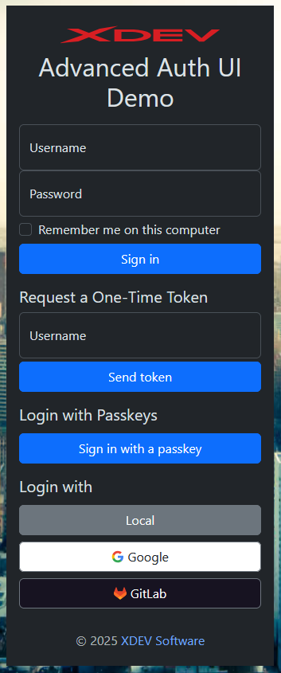

[](https://mvnrepository.com/artifact/software.xdev/spring-security-advanced-authentication-ui)
[](https://github.com/xdev-software/spring-security-advanced-authentication-ui/actions/workflows/checkBuild.yml?query=branch%3Adevelop)
[](https://sonarcloud.io/dashboard?id=xdev-software_spring-security-advanced-authentication-ui)

# spring-security-advanced-authentication-ui

Modernizes the default Spring Web Authentication/Login UI and makes it easier customizable.

<details><summary>Show demo</summary>

<p align="center">

</p>

</details>

## Usage

The library provides an adapter that can be used like this:
```java
public SecurityFilterChain configure(final HttpSecurity http) throws Exception
{
    // Changing the text "Login with" to "Sign in with"
    http.with(new AdvancedLoginPageAdapter<>(http), c -> c
            .customizeLoginPage(p -> p.ssoLoginHeaderText("Sign in with")))
        .oauth2Login(c -> 
            // ...
        )
    // ...
}
```

A more detailed scenario is available in the [demo](./spring-security-advanced-authentication-ui-demo/).

## Installation
[Installation guide for the latest release](https://github.com/xdev-software/spring-security-advanced-authentication-ui/releases/latest#Installation)


## Support
If you need support as soon as possible and you can't wait for any pull request, feel free to use [our support](https://xdev.software/en/services/support).

## Contributing
See the [contributing guide](./CONTRIBUTING.md) for detailed instructions on how to get started with our project.

## Dependencies and Licenses
View the [license of the current project](LICENSE) or the [summary including all dependencies](https://xdev-software.github.io/spring-security-advanced-authentication-ui/dependencies)
